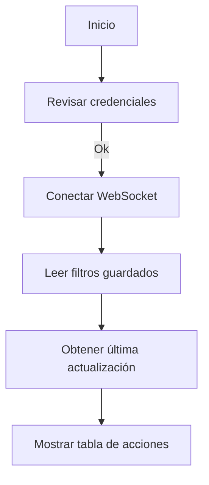
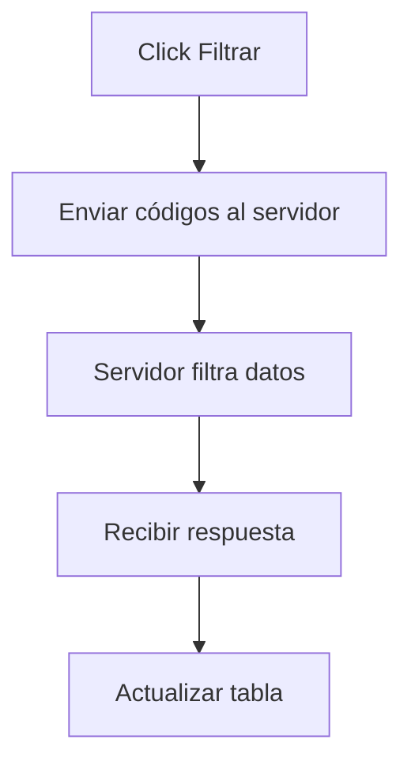
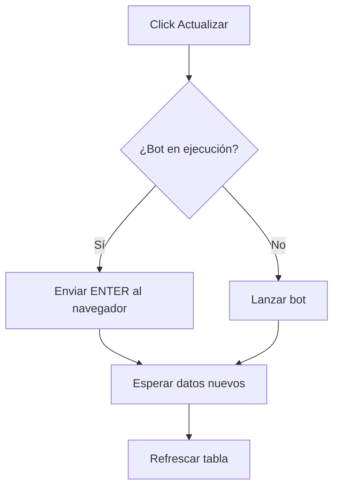

# Flujos principales de la aplicación

Los siguientes diagramas describen de forma simplificada cómo interactúa el usuario con la interfaz web.

## Carga inicial

## Al presionar **Filtrar**

## Al presionar **Actualizar**

