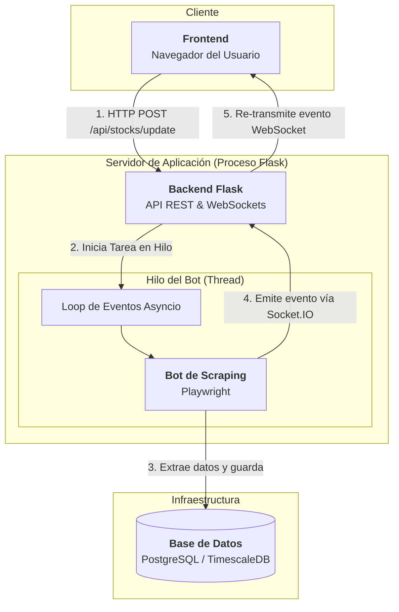

# Arquitectura de Alto Nivel

## 1. Descripción General

La aplicación sigue una **arquitectura monolítica con componentes de fondo desacoplados**, diseñada para ser robusta y responsiva. Consiste en varios componentes principales que trabajan en conjunto.

- **Frontend**: Una interfaz de usuario web interactiva.
- **Backend**: Un servidor web basado en Flask que gestiona la lógica de negocio y la comunicación.
- **Ejecutor de Tareas en Segundo Plano**: Un sistema híbrido que utiliza **hilos de Python (`threading.Thread`)** para las actualizaciones en tiempo real iniciadas por el usuario y **Celery con Redis** para tareas programadas o pesadas.
- **Base de Datos**: Un sistema de persistencia PostgreSQL con TimescaleDB.

La comunicación en tiempo real entre el backend y el frontend se logra mediante **WebSockets (Flask-SocketIO)**.

## 2. Componentes Principales

### 2.2. Backend (Servidor Flask)
- **Responsabilidades**:
    - Servir los archivos estáticos y plantillas que componen el Frontend.
    - Exponer una **API REST** para gestionar las acciones del usuario.
    - Orquestar la ejecución de tareas en segundo plano.
    - **Para tareas urgentes (iniciadas por el usuario)**: Inicia un **hilo (`threading.Thread`)** dedicado para ejecutar el bot de scraping. Esto evita bloquear el servidor web principal mientras se espera el resultado. El hilo gestiona su propio loop de eventos de `asyncio` para correr Playwright.
    - **Para tareas programadas o pesadas (no interactivas)**: Puede encolar una tarea en **Redis** para que sea procesada por un `Celery Worker`.
    - Gestionar las conexiones **WebSocket** para empujar datos nuevos a los clientes.

### 2.3. Ejecutor de Tareas en Segundo Plano
Este no es un único componente, sino un modelo híbrido.

- **Ejecutor en Hilo (Threaded Task Runner)**:
  - **Tecnologías**: Python, `threading`, `asyncio`, Playwright.
  - **Responsabilidades**: Es el mecanismo principal para las actualizaciones del dashboard. Un nuevo hilo se crea por cada solicitud de actualización, gestionando un loop de `asyncio` para controlar el bot de Playwright. Emite eventos de Socket.IO directamente para notificar al frontend sobre el progreso y la finalización.
  
- **Celery Worker (Capacidad Secundaria)**:
  - **Tecnologías**: Python, Celery, Redis.
  - **Responsabilidades**: Es un proceso separado que escucha tareas en una cola de Redis. Se utiliza para trabajos que no requieren una respuesta inmediata al usuario, como el análisis de "drainer" o tareas de mantenimiento programadas.

## 3. Diagrama de Flujo de Datos y Componentes

El siguiente diagrama ilustra la arquitectura real para el flujo principal de actualización.

