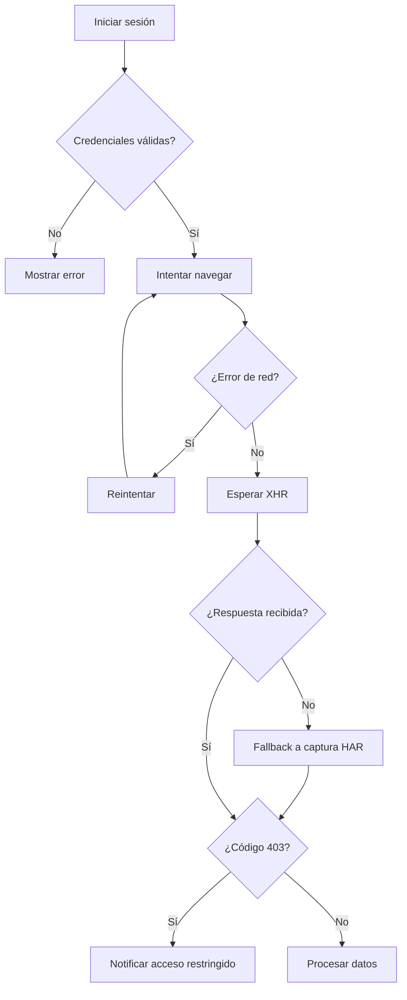

# Flujo de fallos y recuperaciones

Estos diagramas muestran cómo maneja la aplicación los posibles errores.

```mermaid
flowchart TD
    A[Iniciar sesión] --> B{Credenciales válidas?}
    B -- No --> C[Mostrar error]
    B -- Sí --> D[Intentar navegar]
    D --> E{¿Error de red?}
    E -- Sí --> F[Reintentar]
    F --> D
    E -- No --> G[Esperar XHR]
    G --> H{¿Respuesta recibida?}
    H -- No --> I[Fallback a captura HAR]
    I --> J{¿Código 403?}
    H -- Sí --> J
    J -- Sí --> K[Notificar acceso restringido]
    J -- No --> L[Procesar datos]
```
