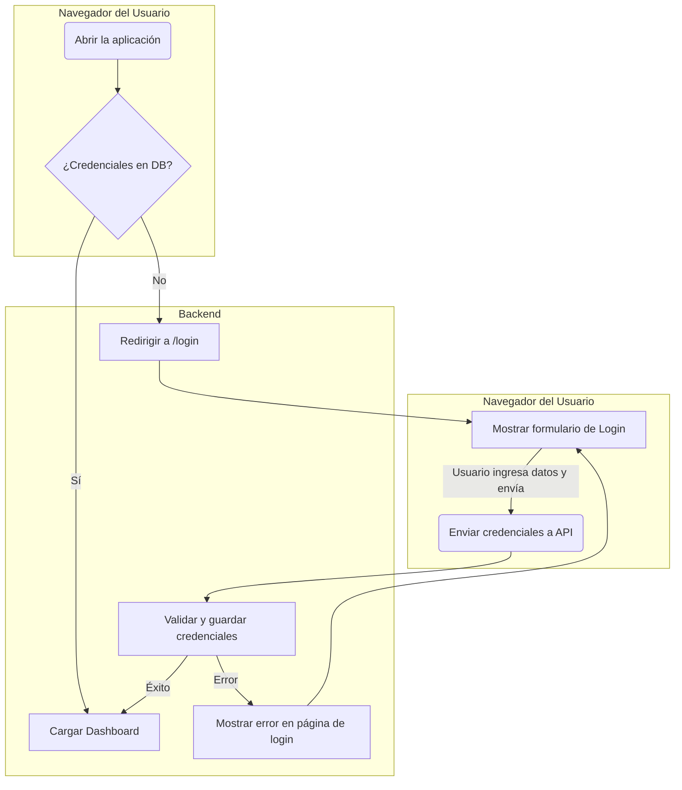
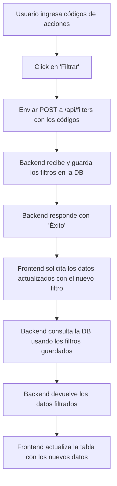
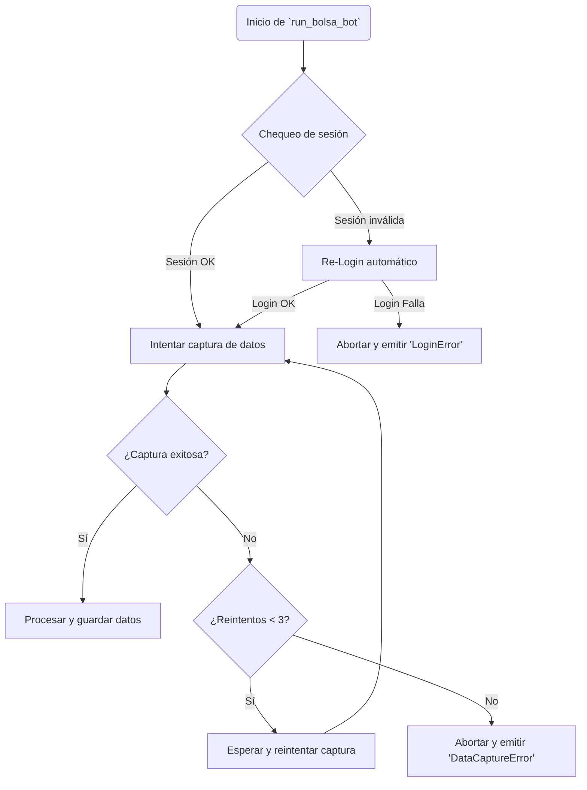

# Mapa de Flujos Funcionales

Este documento describe los flujos de usuario y procesos clave de la aplicación a través de diagramas de flujo.

## 1. Flujo de Primer Acceso e Inicio de Sesión

Este flujo describe lo que sucede cuando un usuario abre la aplicación por primera vez y necesita configurar sus credenciales.



## 2. Flujo de Carga del Dashboard (Usuario ya autenticado)

Una vez que las credenciales están guardadas, este es el flujo de carga principal.

```mermaid
graph TD
    A[Usuario accede a la app] --> B[Backend sirve la página]
    B --> C[Frontend se inicializa]
    C --> D[Conectar al servidor WebSocket]
    D --> E[Solicitar datos iniciales vía API]
    E --> F{Backend consulta la DB}
    F --> G[Obtener última actualización de precios]
    G --> H[Obtener preferencias de filtros y columnas]
    H --> I[Backend envía datos a Frontend]
    I --> J[Frontend renderiza la tabla de acciones]
    J --> K[Listo para interacción]

    W[Servidor WebSocket] <-.-> D
    W -- "Nuevos datos disponibles" .-> J
```

## 3. Flujo de Actualización de Datos (Manual)

Este es el proceso que se desencadena cuando el usuario hace clic en "Actualizar".

```mermaid
graph TD
    subgraph "Frontend"
        A[Click en 'Actualizar'] --> B[Mostrar indicador de carga]
        A --> C(POST /api/stocks/update)
    end
    
    subgraph "Backend (Hilo Principal)"
        C --> D{¿Bot ya está corriendo?}
        D -- Sí --> E[Ignorar petición, responder 'ocupado']
        D -- No --> F[Responder 'proceso iniciado' (202 Accepted)]
        F --> G[Iniciar bot en nuevo Thread]
    end
    
    subgraph "Backend (Hilo del Bot)"
        G -- "asyncio.run_coroutine_threadsafe" --> H(Ejecutar run_bolsa_bot)
        H --> I{Realizar scraping}
        I -- Éxito --> J[Guardar datos en DB]
        J --> K[Emitir evento 'update_complete' por WebSocket]
        I -- Error --> L[Emitir evento 'bot_error' por WebSocket]
    end

    subgraph "Frontend"
        K --> M[Recibir evento y actualizar tabla]
        L --> N[Recibir evento y mostrar notificación de error]
        M --> O[Ocultar indicador de carga]
        N --> O
    end
```

## 4. Flujo de Filtrado de Acciones

Este flujo se activa cuando el usuario aplica un filtro en la tabla.



## 5. Flujo de Manejo de Errores y Reintentos del Bot

El bot de scraping está diseñado para ser resiliente. Este diagrama muestra su lógica interna de recuperación.

