# Modelo de Datos

Este documento describe la estructura lógica y física de la base de datos de la aplicación.

## 1. Diagrama Entidad-Relación (ER)

El siguiente diagrama muestra las tablas principales de la base de datos y sus relaciones.

```mermaid
erDiagram
    Users {
        int id PK
        string username
        string email
    }
    Credentials {
        int id PK
        string username
        string password
    }
    Alerts {
        int id PK
        string symbol
        float target_price
    }
    StockPrices {
        string symbol PK
        datetime timestamp PK
        float price
    }
    StockClosings {
        date date PK
        string nemo PK
        float previous_day_close_price
    }
    Portfolio {
        int id PK
        string symbol
        int quantity
    }
    Dividends {
        int id PK
        string nemo
        date payment_date
    }
    StockFilters {
        int id PK
        text codes_json
    }
    AnomalousEvent {
        int id PK
        string nemo
        date event_date
        string event_type
    }
    AdvancedKPI {
        int id PK
        string nemo
        date date
        json source_details
    }
    PromptConfig {
        int id PK
        string api_provider
        string api_key
    }
    KpiSelection {
        int id PK
        string kpi_name
        boolean is_selected
    }
    PortfolioColumnPreference {
        int id PK
        text columns_json
    }
    ClosingColumnPreference {
        int id PK
        text columns_json
    }
    DividendColumnPreference {
        int id PK
        text columns_json
    }
    KpiColumnPreference {
        int id PK
        text columns_json
    }


    Users ||--o{ Alerts : "configura"
    StockClosings ||--o{ AdvancedKPI : "tiene"
```



*Nota: Aunque no todas las relaciones están forzadas con claves foráneas a nivel de base de datos, existen lógicamente.*

## 2. Descripción de Tablas Principales y Definiciones (Pseudo-SQL)

A continuación se detalla el propósito y la estructura de las tablas más importantes.

### `stock_prices`
Almacena los datos de series temporales de los precios de las acciones. **Esta es una hypertable de TimescaleDB.**

```sql
CREATE TABLE stock_prices (
    symbol VARCHAR(50) NOT NULL,
    "timestamp" TIMESTAMPTZ NOT NULL,
    price FLOAT,
    variation FLOAT,
    buy_price FLOAT,
    sell_price FLOAT,
    amount BIGINT,
    traded_units BIGINT,
    currency VARCHAR(10),
    isin VARCHAR(50),
    green_bond VARCHAR(5),
    PRIMARY KEY (symbol, "timestamp")
);

-- Comando TimescaleDB ejecutado después de la creación
SELECT create_hypertable('stock_prices', 'timestamp');
```

### `users`
Guarda la información de los usuarios de la aplicación. (Actualmente parece una funcionalidad en desarrollo).

```sql
CREATE TABLE users (
    id SERIAL PRIMARY KEY,
    username VARCHAR(80) UNIQUE NOT NULL,
    email VARCHAR(120) UNIQUE NOT NULL
);
```

### `credentials`
Almacena las credenciales para iniciar sesión en el sitio de la Bolsa de Santiago. En la implementación actual, suele haber un único registro global.

```sql
CREATE TABLE credentials (
    id SERIAL PRIMARY KEY,
    username VARCHAR(255) NOT NULL,
    password VARCHAR(255) NOT NULL -- Se asume encriptación a nivel de aplicación si es necesario
);
```

### `portfolio`
Registra las acciones que posee el usuario, formando su cartera.

```sql
CREATE TABLE portfolio (
    id SERIAL PRIMARY KEY,
    symbol VARCHAR(50) NOT NULL,
    quantity FLOAT NOT NULL,
    purchase_price FLOAT NOT NULL
);
```

### `alerts`
Configuración de alertas de precios para acciones específicas.

```sql
CREATE TABLE alerts (
    id SERIAL PRIMARY KEY,
    user_id INTEGER REFERENCES users(id),
    symbol VARCHAR(50) NOT NULL,
    target_price FLOAT NOT NULL,
    condition VARCHAR(10) NOT NULL, -- "above" o "below"
    status VARCHAR(20) NOT NULL, -- "active", "triggered", etc.
    created_at TIMESTAMPTZ,
    triggered_at TIMESTAMPTZ
);
```

### `dividends`
Almacena información sobre los dividendos pagados por las acciones.

```sql
CREATE TABLE dividends (
    id SERIAL PRIMARY KEY,
    nemo VARCHAR(20) NOT NULL,
    description VARCHAR(255),
    limit_date DATE NOT NULL,
    payment_date DATE NOT NULL,
    currency VARCHAR(10),
    value FLOAT NOT NULL,
    UNIQUE (nemo, payment_date, description)
);
```

### `anomalous_events`
Resultados del análisis "drainer" para detectar eventos inusuales en el mercado.

```sql
CREATE TABLE anomalous_events (
    id SERIAL PRIMARY KEY,
    nemo VARCHAR(20) NOT NULL,
    event_date DATE NOT NULL,
    event_type VARCHAR(50),
    description TEXT,
    source VARCHAR(100),
    price_change_pct FLOAT,
    analysis_timestamp TIMESTAMPTZ
);
```

### `advanced_kpis`
Almacenará KPIs avanzados, potencialmente generados por IA, para análisis financiero.

```sql
CREATE TABLE advanced_kpis (
    id SERIAL PRIMARY KEY,
    nemo VARCHAR(50) NOT NULL,
    date DATE NOT NULL,
    roe FLOAT,
    beta FLOAT,
    debt_to_equity FLOAT,
    analyst_recommendation TEXT,
    source_details JSON,
    calculation_details JSON,
    FOREIGN KEY (nemo, date) REFERENCES stock_closings (nemo, date)
);
```

### `prompt_configs`
Guardará la configuración para llamar a las APIs de IA.

```sql
CREATE TABLE prompt_configs (
    id SERIAL PRIMARY KEY,
    api_provider VARCHAR(100),
    api_key VARCHAR(255),
    prompt_template TEXT
);
```

### Tablas de Configuración y Preferencias
Existen varias tablas para guardar las preferencias del usuario:
- **`stock_filters`**: Guarda los códigos de las acciones que el usuario desea filtrar.
- **`portfolio_column_preference`**, **`closing_column_preference`**, **`dividend_column_preference`**, **`kpi_column_preference`**: Almacenan las columnas visibles para cada tabla en la UI.
- **`kpi_selection`**: Guarda qué KPIs ha seleccionado el usuario para ser calculados o mostrados.

## 3. Uso de TimescaleDB

La principal característica de la base de datos es el uso de la extensión **TimescaleDB** para la tabla `stock_prices`.

- **¿Qué es una Hypertable?**: Al convertir `stock_prices` en una hypertable, TimescaleDB la particiona automáticamente en segundo plano en trozos más pequeños (chunks), principalmente por la columna de tiempo (`timestamp`).
- **Ventajas**:
    - **Rendimiento en Inserciones**: Las inserciones de nuevos datos de precios son mucho más rápidas porque solo afectan al "chunk" más reciente.
    - **Consultas de Tiempo Eficientes**: Las consultas que filtran por rangos de tiempo (ej. "mostrar los precios de la última semana") son extremadamente rápidas, ya que TimescaleDB solo necesita leer los chunks relevantes en lugar de escanear toda la tabla.
    - **Gestión de Datos Simplificada**: Facilita políticas de retención de datos (ej. borrar automáticamente datos con más de X años) y la compresión de datos antiguos.

La creación de la hypertable se realiza automáticamente después de que SQLAlchemy crea la tabla, gracias a un listener de eventos de DDL definido en el modelo `StockPrice`. 